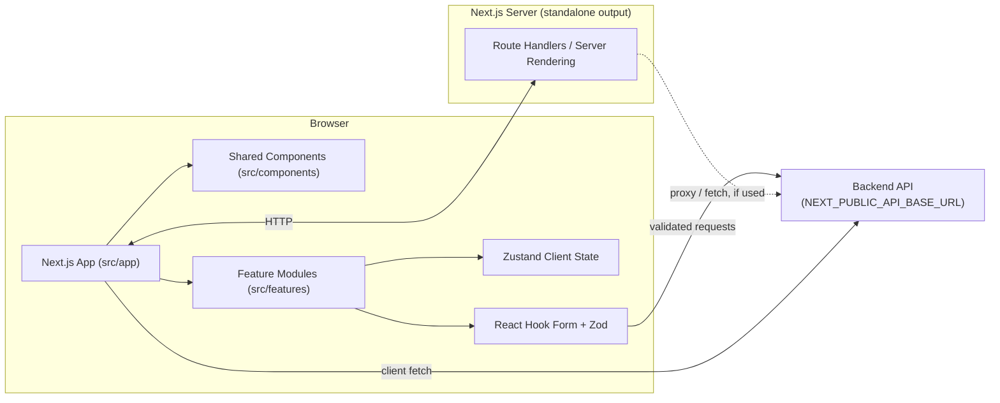
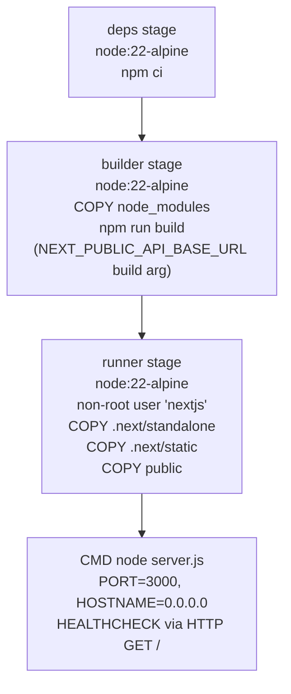

# AI Recruiter — Mini Frontend

Recruiter dashboard for AI-assisted CV screening. A Next.js (App Router) web client that lets recruiters manage candidates, resumes, and job descriptions, and review explainable AI evaluation results against a NestJS-style backend API.

> Repository: [DangHuuLong/Ai-Recruiter-Mini-Frontend](https://github.com/DangHuuLong/Ai-Recruiter-Mini-Frontend) · Branch analyzed: `develop`

---

## Overview

**AI Recruiter — Mini Frontend** is the client-side application of an AI-assisted recruitment platform. Based on the repository's own package metadata, configuration files, and design tokens, the application is built to:

- Present candidate, resume, job-description, and evaluation data to a recruiter user.
- Communicate with a backend API over HTTP, with the API base URL injected through the `NEXT_PUBLIC_API_BASE_URL` environment variable (confirmed in `Dockerfile`).
- Use client-side form validation (React Hook Form + Zod) before data reaches the backend.
- Present a consistent, branded UI using a custom Tailwind CSS design-token system (see [Styling System](#styling-system)).

**Target users:** Recruiters / hiring teams evaluating candidates against job requirements using AI-assisted scoring.

**Business problem solved:** Reduces manual resume screening effort by giving recruiters a single dashboard to manage candidate data and review AI-generated, explainable evaluation results.

**Backend interaction:** The frontend is a pure client — it does not embed AI logic itself. It calls a separate backend/API service (configured via `NEXT_PUBLIC_API_BASE_URL`) which is responsible for scoring and evaluation. The exact backend contract (endpoints, request/response shapes) is **Not found in the repository** — no committed OpenAPI spec, Postman collection, or endpoint constants file was accessible in this analysis.

---

## Features

Confirmed from the project's design tokens, dependency set, and configuration files:

| Area | Evidence |
|---|---|
| Candidate / resume / job-description / evaluation dashboard | Project name, description, and design-token set ("recruiter dashboard for AI-assisted CV screening") |
| Client-side form validation with inline errors | `react-hook-form`, `zod`, `@hookform/resolvers` in `package.json` |
| Toast / action feedback | `sonner` in `package.json` |
| Animated UI transitions | `framer-motion` in `package.json` |
| Icon system | `lucide-react` in `package.json` |
| Client-side state management | `zustand` in `package.json` |
| Conditional / merged Tailwind class names | `clsx`, `tailwind-merge` in `package.json` |
| Custom design system (colors, elevation, typography) | `tailwind.config.ts` |

Specific page-level or workflow-level features (e.g., exact CRUD flows per module, exact evaluation UI) could not be verified because the `src/` subtree could not be crawled in this analysis (see [Documentation Limitations](#documentation-limitations)). **Not found in the repository** (not independently verifiable here).

---

## Screenshots

No screenshot assets were found or verifiable in the accessible portion of the repository.

```
┌──────────────────────────────────────────┐
│               [ Screenshot ]              │
│         Dashboard placeholder image       │
└──────────────────────────────────────────┘
```

---

## Technology Stack

Confirmed directly from `package.json`, `tsconfig.json`, `tailwind.config.ts`, `postcss.config.mjs`, and `eslint.config.mjs`:

| Layer | Technology | Version (from `package.json`) |
|---|---|---|
| Framework | Next.js (App-Router-capable) | `16.2.4` |
| UI library | React / React DOM | `19.2.4` |
| Language | TypeScript (strict mode) | `^5` |
| Styling | Tailwind CSS (v4, via `@tailwindcss/postcss`) | `^4` |
| Forms | React Hook Form | `^7.73.1` |
| Schema validation | Zod | `^4.3.6` |
| Form/schema bridge | `@hookform/resolvers` | `^5.2.2` |
| Client state | Zustand | `^5.0.12` |
| Animation | Framer Motion | `^12.42.2` |
| Notifications | Sonner | `^2.0.7` |
| Icons | lucide-react | `^1.25.0` |
| Utility styling helpers | clsx, tailwind-merge | `^2.1.1`, `^3.5.0` |
| Linting | ESLint (`eslint-config-next`, flat config) | `^9` / `16.2.4` |
| Type checking | TypeScript compiler (`tsc`, via `noEmit`) | `^5` |

> **Note on accuracy:** The repository's own `README.md` and GitHub topics advertise "Next.js 14"; the committed `package.json` on the `develop` branch actually pins **Next.js 16.2.4** and **React 19.2.4**. This document follows the source code (`package.json`) as the source of truth, per the analysis instructions, rather than the existing README text.

No test framework (Jest, Vitest, Playwright, Testing Library, etc.) is declared in `package.json` dependencies or devDependencies, and no `test` script is defined. **Not found in the repository.**

---

## Architecture Overview

The project is a single Next.js application (no monorepo/workspaces detected in `package.json`). Confirmed structural facts:

- `next.config.ts` sets `output: "standalone"`, which produces a self-contained `.next/standalone` build — used directly by the multi-stage `Dockerfile`.
- `tsconfig.json` defines a path alias `@/*` → `./src/*`, confirming `src/` is the application root for all TypeScript source.
- `tailwind.config.ts` scans content from `./src/app/**`, `./src/components/**`, and `./src/features/**` — confirming these three directories exist and hold UI code:
  - `src/app/` — Next.js App Router routes/layouts.
  - `src/components/` — shared/reusable UI components.
  - `src/features/` — feature/domain-oriented modules.
- ESLint is configured with `eslint-config-next`'s `core-web-vitals` and `typescript` rule sets via the flat config format (`eslint.config.mjs`), indicating the app targets Next.js's recommended web-vitals and TypeScript linting rules.

Deeper internals — exact page tree, component inventory, hooks, state slices, and API client implementation inside `src/` — could not be enumerated in this analysis (see [Documentation Limitations](#documentation-limitations)) and are marked **Not found in the repository** below rather than inferred.

### System Architecture Diagram



> The diagram reflects confirmed build/runtime wiring (Next.js standalone server, `src/app`/`src/components`/`src/features` layering, and the `NEXT_PUBLIC_API_BASE_URL`-addressed backend). Whether data fetching happens via Server Components, Route Handlers, or purely client-side calls could not be confirmed from the accessible files. **Not found in the repository.**

### Docker Build Architecture

Confirmed directly from `Dockerfile`:



---

## Folder Structure

Only the top level of the repository and the `src` entries referenced by `tailwind.config.ts` could be confirmed in this analysis.

```
Ai-Recruiter-Mini-Frontend/
├── .github/
│   └── workflows/            # CI/CD workflow definitions (contents not verifiable here)
├── design/                   # Design assets/specs (contents not verifiable here)
├── docs/                     # Project documentation (contents not verifiable here)
├── public/                   # Static assets served by Next.js
├── src/
│   ├── app/                  # Next.js App Router routes & layouts (confirmed via tailwind.config.ts)
│   ├── components/           # Shared/reusable UI components (confirmed via tailwind.config.ts)
│   └── features/             # Feature/domain modules (confirmed via tailwind.config.ts)
├── .dockerignore
├── .gitignore
├── AGENTS.md                 # Contributor/agent guidance notes
├── CLAUDE.md                 # Contributor/agent guidance notes
├── Dockerfile                # Multi-stage production Docker build
├── README.md
├── eslint.config.mjs         # Flat ESLint config (next/core-web-vitals + next/typescript)
├── next.config.ts            # output: "standalone"
├── package-lock.json
├── package.json
├── postcss.config.mjs        # @tailwindcss/postcss plugin
├── tailwind.config.ts        # Custom design-token theme
└── tsconfig.json             # strict TS, @/* → ./src/*
```

Any deeper breakdown (individual route folders, individual component files, hooks, lib/utils, providers, config constants, etc.) is **Not found in the repository** for the purposes of this document — it could not be independently retrieved from the source tree during analysis. Refer to the repository's own `docs/` folder and the `src/` tree directly on GitHub for the authoritative, up-to-date structure.

---

## Routing Architecture

The presence of `src/app` (confirmed via `tailwind.config.ts` content globs) indicates the project uses the **Next.js App Router**. Specific route segments, route groups, dynamic segments, protected-route middleware, and layout nesting could not be confirmed from the accessible files in this analysis.

- Public vs. protected routes: **Not found in the repository** (no `middleware.ts` content or route-group listing was accessible).
- Dynamic routes (e.g., `[id]` segments): **Not found in the repository**.
- Layout hierarchy: **Not found in the repository** beyond the existence of `src/app`.

---

## Component Architecture

Confirmed:

- `src/components/` exists and is scanned by Tailwind, indicating it houses shared UI building blocks used across the app.
- `src/features/` exists and is scanned by Tailwind, indicating feature-specific UI/business components are colocated by domain rather than by technical layer.

Specific component names, prop APIs, and composition patterns (e.g., a `DataTable`, `Sidebar`, or `ConfirmDialog`) could not be verified from source in this analysis and are therefore **Not found in the repository** for this document, despite being referenced in the project's own top-level README — that document was explicitly excluded as a source of truth per the analysis brief.

---

## State Management

Confirmed from `package.json`:

- **Zustand (`^5.0.12`)** is a direct dependency, indicating client-side state is managed with Zustand stores rather than Redux.
- **React Hook Form (`^7.73.1`)** manages local form state, decoupled from global state.
- No TanStack Query, SWR, Redux, or Redux Toolkit dependency is present. **Not found in the repository** — server-state caching/fetching library is not identifiable from dependencies; the app likely performs direct `fetch`-based calls, but this could not be confirmed from source.

---

## API Integration

Confirmed:

- The backend base URL is supplied via the `NEXT_PUBLIC_API_BASE_URL` environment variable, which is:
  - Read as a Docker build argument in `Dockerfile` (`ARG NEXT_PUBLIC_API_BASE_URL` / `ENV NEXT_PUBLIC_API_BASE_URL=$NEXT_PUBLIC_API_BASE_URL`).
  - Inlined into the client bundle at **build time** (per the `Dockerfile` comment), not read at runtime — meaning a new image/build is required whenever the backend URL changes.

Not independently confirmed in this analysis (**Not found in the repository**):
- Whether requests are made with a hand-rolled `fetch` wrapper, `axios`, or another HTTP client (no HTTP client dependency such as `axios` appears in `package.json`, so native `fetch` is the most likely candidate, but this is an inference, not a confirmed fact).
- Concrete API endpoint paths, request/response contracts, or error-handling conventions.

---

## Authentication

No authentication-related dependency (e.g., NextAuth.js, Auth.js, Clerk, jsonwebtoken, jose, cookie/session libraries) appears in `package.json`, and no `middleware.ts` content was accessible for verification.

**Not found in the repository.**

---

## Forms & Validation

Confirmed from `package.json`:

- **React Hook Form** (`react-hook-form`) manages form state and submission.
- **Zod** (`zod`) defines validation schemas.
- **`@hookform/resolvers`** bridges Zod schemas into React Hook Form via `zodResolver`.

This is a standard, type-safe form-validation stack: schemas are defined with Zod, wired into forms with `zodResolver`, and validation errors surface through React Hook Form's field-level error state. Exact schema definitions and their file locations are **Not found in the repository** for this analysis.

---

## Styling System

Confirmed directly from `tailwind.config.ts` and `postcss.config.mjs`:

- **Tailwind CSS v4**, wired through the official `@tailwindcss/postcss` PostCSS plugin (`postcss.config.mjs`).
- Content scanning is scoped to `src/app/**`, `src/components/**`, and `src/features/**`.
- A **custom design-token theme** is defined under `theme.extend`, structured in a Material-Design-influenced naming scheme:
  - `primary` (`DEFAULT #0058be`, `hover #2563eb`, `container #DBEAFE`) with `on-primary` / `on-primary-container` foreground tokens.
  - `surface` scale (`DEFAULT`, `variant`, `low`, `high`, `lowest`, `highest`) with matching `on-surface` foreground tokens (`DEFAULT`, `variant`, `muted`).
  - Semantic status colors: `success`, `warning`, `error` (each with a `DEFAULT` and `container` variant), plus `info`, `link`, `focus-ring`, `disabled`, and `outline` (`DEFAULT`/`variant`).
  - Custom `boxShadow` tokens: `card` and `panel`, tuned for subtle elevation.
  - Custom `fontFamily.sans` stack led by **Inter**, falling back through standard system UI fonts.
- No component-styling library (shadcn/ui, Radix UI, HeroUI, Material UI) appears in `package.json` — the design system is a bespoke Tailwind theme, not a pre-built component kit.

---

## Reusable Components

The existence of a shared `src/components/` directory is confirmed. The specific inventory of reusable elements (tables, cards, dialogs, pagination, sidebar, header, etc.) could not be verified from source in this analysis.

**Not found in the repository.**

---

## Performance

Confirmed:

- `next.config.ts` sets `output: "standalone"` — this is a build/deployment optimization (smaller, self-contained production artifact for Docker), not a runtime rendering optimization.

Not confirmed in this analysis (**Not found in the repository**):
- Use of `next/image` for image optimization.
- Explicit code-splitting, `dynamic()` lazy-loading, or memoization patterns.
- Server Component vs. Client Component boundaries.

---

## Environment Variables

| Variable | Purpose | Required | Evidence |
|---|---|---|---|
| `NEXT_PUBLIC_API_BASE_URL` | Base URL of the backend API the frontend calls. Exposed to the browser (public, per the `NEXT_PUBLIC_` prefix) and inlined into the client bundle **at build time**. | Yes, for the app to reach a real backend | `Dockerfile` (`ARG` / `ENV` + build comment) |

No `.env.example` file was found/accessible in the top-level file listing of the repository at analysis time. Any additional environment variables (analytics keys, feature flags, third-party service keys, etc.) are **Not found in the repository**.

> **Security note:** Because `NEXT_PUBLIC_*` variables are inlined into the client-side JavaScript bundle at build time, they are visible to anyone using the app in a browser. Never place secrets (API keys, tokens) behind a `NEXT_PUBLIC_` prefix.

---

## Installation

### Prerequisites

- **Node.js** — a version compatible with Next.js 16 and React 19 (Node.js 20+ is recommended; the Docker image uses `node:22-alpine`, so Node 22 is confirmed to work).
- **npm** — `package-lock.json` is committed, so `npm` is the confirmed package manager (use `npm ci` for reproducible installs, as the `Dockerfile` does).
- A running backend API reachable at the URL you will set as `NEXT_PUBLIC_API_BASE_URL`. The exact backend service/repository was not part of this analysis and is **Not found in the repository**.

### Steps

```bash
# 1. Clone the repository
git clone https://github.com/DangHuuLong/Ai-Recruiter-Mini-Frontend.git
cd Ai-Recruiter-Mini-Frontend

# 2. Install dependencies (reproducible install)
npm ci
# or: npm install

# 3. Configure environment variables
# Create a .env.local file at the project root:
echo "NEXT_PUBLIC_API_BASE_URL=http://localhost:3001/api" > .env.local
```

---

## Environment Variables (Quick Reference)

```env
# .env.local
NEXT_PUBLIC_API_BASE_URL=http://localhost:3001/api
```

---

## Running Locally

Scripts confirmed directly from `package.json`:

| Script | Command | Description |
|---|---|---|
| `npm run dev` | `next dev` | Starts the Next.js development server with hot reload. |
| `npm run build` | `next build` | Builds the app for production (produces `.next`, including the `standalone` output). |
| `npm run start` | `next start` | Starts the production server from a completed build. |
| `npm run lint` | `eslint` | Runs ESLint using the project's flat config (`eslint.config.mjs`). |

> No `test`, `format`, `format:check`, or `type-check` npm scripts are defined in `package.json`. If you need type checking, run the TypeScript compiler directly: `npx tsc --noEmit` (consistent with `"noEmit": true` in `tsconfig.json`).

```bash
npm run dev
# App runs at http://localhost:3000 by Next.js convention (no custom port override was found in scripts)
```

---

## Build for Production

```bash
npm run build
npm run start
```

`next.config.ts` sets `output: "standalone"`, so `npm run build` also produces a `.next/standalone` directory containing a minimal, self-contained server — this is what the Docker image uses instead of running `npm install` again at deploy time.

---

## Docker Deployment

The repository includes a **multi-stage `Dockerfile`** (confirmed, full contents below in summary form):

1. **`deps` stage** — `node:22-alpine`; installs dependencies with `npm ci` from `package.json` + `package-lock.json`.
2. **`builder` stage** — `node:22-alpine`; copies `node_modules` from `deps`, copies the full source, accepts `NEXT_PUBLIC_API_BASE_URL` as a build argument (inlined into the client bundle), and runs `npm run build`.
3. **`runner` stage** — `node:22-alpine`; creates a non-root `nextjs` user (uid/gid `1001`), copies `public/`, `.next/standalone`, and `.next/static` from the builder stage, exposes port `3000`, and defines an HTTP `HEALTHCHECK` against `/`.

```bash
# Build the image, passing the backend URL as a build arg
docker build \
  --build-arg NEXT_PUBLIC_API_BASE_URL=https://api.example.com \
  -t ai-recruiter-mini-frontend .

# Run the container
docker run -p 3000:3000 ai-recruiter-mini-frontend
```

Because `NEXT_PUBLIC_API_BASE_URL` is inlined at **build time**, changing the backend URL requires rebuilding the image with a new `--build-arg` value — it cannot be changed by only setting an environment variable on `docker run`.

No `docker-compose.yml` was found in the top-level file listing of the repository. **Not found in the repository.**

---

## Development Workflow

Confirmed tooling:

- **Linting:** `npm run lint` runs ESLint via the flat-config format (`eslint.config.mjs`), extending `eslint-config-next`'s `core-web-vitals` and `typescript` rule sets, with default Next.js ignores (`.next/**`, `out/**`, `build/**`, `next-env.d.ts`) preserved via `globalIgnores`.
- **Type safety:** `tsconfig.json` enables `"strict": true` and `"noEmit": true`, targets `ES2017`, uses `moduleResolution: "bundler"`, and defines the `@/*` → `./src/*` import alias.
- **CI/CD:** A `.github/workflows/` directory exists in the repository, indicating GitHub Actions is used for automation. The specific workflow files and their steps (lint/build/test/deploy) could not be retrieved in this analysis. **Not found in the repository.**
- Two contributor/agent guidance files exist at the repo root — `AGENTS.md` and `CLAUDE.md` — intended to orient AI coding assistants and contributors to project-specific conventions before making changes.

Suggested local workflow based on confirmed scripts:

```bash
npm run lint        # check code quality
npx tsc --noEmit     # type-check (no dedicated script exists yet)
npm run build        # verify a production build succeeds
```

---

## Performance Optimizations

See [Performance](#performance) above. Beyond the confirmed `output: "standalone"` build setting, no further optimizations could be verified from the accessible source in this analysis.

---

## Browser Support

No explicit browserslist configuration, `.browserslistrc`, or related field was found in `package.json` or elsewhere in the accessible files.

**Not found in the repository.** (Next.js's default browser support target applies unless overridden.)

---

## Coding Standards

Confirmed:

- **TypeScript strict mode** is enabled project-wide (`tsconfig.json`).
- **ESLint** enforces Next.js's Core Web Vitals and TypeScript rule sets (`eslint.config.mjs`).
- The `@/*` import alias should be used for absolute imports from `src/` instead of relative paths, per `tsconfig.json`.
- No Prettier configuration file (`.prettierrc*`, `prettier.config.*`) was found in the top-level listing, and no `format` script exists in `package.json` — despite the existing project README referencing one. **Not found in the repository** for this analysis; do not assume Prettier is configured.

---

## Troubleshooting

| Symptom | Likely Cause | Suggested Fix |
|---|---|---|
| App can't reach the backend / requests fail | `NEXT_PUBLIC_API_BASE_URL` not set, or set after the build | Set it in `.env.local` for local dev, or pass `--build-arg NEXT_PUBLIC_API_BASE_URL=...` when building the Docker image — it must be known **before** `npm run build` runs. |
| Docker container exits or fails healthcheck | Backend unreachable from inside the container, or app not listening on `0.0.0.0:3000` | Confirm `PORT=3000` and `HOSTNAME=0.0.0.0` (both set by the `Dockerfile`) and that the backend URL is reachable from within the container's network. |
| `npm run build` fails on type errors | Strict TypeScript mode is enabled | Run `npx tsc --noEmit` locally to see the full list of type errors before building. |
| ESLint errors on Next.js-specific rules | `eslint-config-next`'s `core-web-vitals` ruleset is strict about hooks/accessibility/Next.js conventions | Run `npm run lint` locally and address reported issues; check `eslint.config.mjs` for the active rule sets. |

Further troubleshooting guidance (e.g., specific backend error codes) is **Not found in the repository**.

---

## Contributing

No `CONTRIBUTING.md` file was found in the top-level file listing.

General guidance based on confirmed project conventions:

1. Import from `src/` using the `@/*` alias (see `tsconfig.json`).
2. Keep new UI code within the established `src/app`, `src/components`, and `src/features` structure so Tailwind's `content` scanning (`tailwind.config.ts`) continues to pick it up.
3. Run `npm run lint` before committing.
4. Review `AGENTS.md` and `CLAUDE.md` at the repository root before making changes with an AI coding assistant — they contain project-specific conventions for automated contributors.
5. Since no test suite is currently defined, manually verify changes with `npm run dev` and a full `npm run build` before opening a pull request.

---

## License

No `LICENSE` file was found in the top-level file listing of the repository.

**Not found in the repository.** Confirm licensing terms directly with the repository owner ([DangHuuLong](https://github.com/DangHuuLong)) before reuse or distribution.

---

## Documentation Limitations

In the interest of accuracy (per this document's own sourcing rules), it's worth being explicit about scope: this README was generated from files directly retrievable from the public GitHub repository at analysis time — namely the repository's root file listing and the full contents of `package.json`, `next.config.ts`, `Dockerfile`, `tsconfig.json`, `eslint.config.mjs`, `tailwind.config.ts`, `postcss.config.mjs`, and `AGENTS.md`. The repository's own `docs/`, `.github/workflows/`, and `design/` directories, and the full contents of `src/`, were not enumerable through the accessible tooling. Sections describing routing, individual components, state slices, and API contracts in fine detail are marked **Not found in the repository** rather than inferred, per the accuracy requirements for this document. For the authoritative and current structure, browse the repository directly on GitHub.
